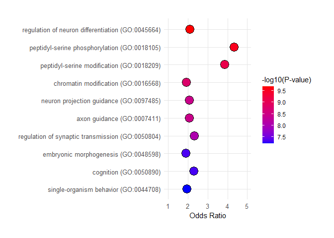

## R Markdown

This is an R Markdown documenting the processing of sncRNAseq data from
extracellular vesicles (EVs) isolated from Motherhealth plasma samples
collected postpartum. The study profiled preelampsia cases (n=26) and
normotensive controls (n=13). EVs were isolated using IZON SEC columns.
RNA was extracted using the miRNeasy isolation kit. Out of 39 samples
sent to RealSeq for small RNAseq, 35 were successfully sequenced. FASTQ
files were received with adapters trimmed. The reads were aligned using
STAR version 2.7.10b using the gencode v43 human reference genome
(hg38). Counts were generated using the featureCounts function of
Rsubread 2.12.3. Features were annotated for sRNAs using the ITAS
database following the workflow outlined by Stupnikov et al., 2022:
<https://github.com/EpiEpiMSU/ITAS>. Using this workflow, 18948 sRNA
elements were detected.

Low abundant reads were filtered with a cutoff of mean count \> 5, with
819 elements remaining (<https://www.mdpi.com/1422-0067/24/4/4195>). The
most abundant snRNA features were miRNA (n=150), Other (n=143), piRNA
(n=173), rRNA (n=123), and tRNA (n=230). CIBERSORT was conducted to
ennumerate EV cell-type contributions using a published miRNA tissue
reference dataset(Srinivasan et al., 2020; <PMID:32864636>) Differential
expression of 41 snRNAs were identified at an FDR \< 0.05 comparing
preeclampsia cases vs. controls, adjusting for 3 surrogate variables ,
gestational age, and maternal BMI. Gene Ontology Enrichment Pathway
analysis was performed on the top differentially expressed miRNAs
(let7f-5p, miR143-p, miR335-5p,
miR27a-p,miR26b-5p,miR20a-5p,miR146a-5p).

## Load Covariate data

``` r
Covariates<-readRDS("C:/Users/mk2583/OneDrive - cumc.columbia.edu/Projects/MotherHealth_Miller/Data/Covariates/Covariates_pilot.rds")

CIBERSORT_reference<-readRDS("C:/Users/mk2583/OneDrive - cumc.columbia.edu/Deyssenroth_Lab/Tutorials/miRNATissueAtlas_CIBERSORT/miRNA_reference.rds")
```

## Clean-up covariate data

``` r
Covariates<-Covariates%>%
  droplevels()
```

## Demotable

``` r
demo<-Covariates%>%
  mutate(BMI=ifelse(BMI=="obese",paste0(intToUtf8(8805),"30"),"<30"),
         delivery_mode=ifelse(delivery_mode=="C/S","C-Section","Vaginal"))%>%
  dplyr::select(Group,Collection_interval,BMI,delivery_mode,Gest.age,Race.ethnicity)%>%
tbl_summary(
    by = Group,
    statistic = list(all_continuous()  ~ "{mean} ({sd})",
                     all_categorical() ~ "{n}    ({p}%)"),
    digits = list(all_continuous()  ~ c(2, 2),
                  all_categorical() ~ c(0, 1)),
    type = list(Collection_interval ~ "continuous",
                BMI ~ "categorical",
                Race.ethnicity ~ "categorical",
                delivery_mode ~ "categorical",
                Gest.age ~ "continuous"),
    label  = list(Collection_interval ~ "Time to collection (days)",
                BMI ~ paste0("Maternal BMI kg/m",supsc("2")),
                Race.ethnicity ~ "Race/ethnicity",
                delivery_mode ~ "Delivery Mode",
                Gest.age ~ "Gestational age (weeks)")
  ) %>%
  add_p(pvalue_fun = ~ style_pvalue(.x, digits = 2)) %>%
  modify_header(label = "**Variable**",
                all_stat_cols() ~ "**{level}**<br>N = {n} ({style_percent(p, digits=1)}%)") %>%
  bold_labels() %>%
  modify_caption("<div style='text-align: left; font-weight: bold;'>Table1. Motherhealth participant characteristics</div>")


Demo_table_study_csv<-demo%>%
 as_tibble() 

#knitr::knit_print(demo)
demo%>%
  as_kable()
```

Table:

<div style="text-align: left; font-weight: bold;">

Table1. Motherhealth participant characteristics

</div>

| **Variable**                  | **Normotensive**<br>N = 9 (25.7%) | **Preeclampsia**<br>N = 26 (74.3%) | **p-value** |
|:------------------------------|:---------------------------------:|:----------------------------------:|:-----------:|
| **Time to collection (days)** |            1.33 (0.71)            |            2.15 (1.32)             |    0.10     |
| **Maternal BMI kg/m²**        |                                   |                                    |    0.018    |
| \<30                          |             8 (88.9%)             |             10 (38.5%)             |             |
| ≥30                           |             1 (11.1%)             |             16 (61.5%)             |             |
| **Delivery Mode**             |                                   |                                    |    0.26     |
| C-Section                     |             3 (33.3%)             |             15 (57.7%)             |             |
| Vaginal                       |             6 (66.7%)             |             11 (42.3%)             |             |
| **Gestational age (weeks)**   |           39.24 (0.93)            |            35.00 (2.84)            |   \<0.001   |
| **Race/ethnicity**            |                                   |                                    |    0.58     |
| Non-Hispanic White            |             3 (37.5%)             |             6 (24.0%)              |             |
| Hispanic                      |             4 (50.0%)             |             17 (68.0%)             |             |
| Black                         |             1 (12.5%)             |              2 (8.0%)              |             |
| Unknown                       |                 1                 |                 1                  |             |

``` r
#save table  
write.csv(Demo_table_study_csv, "../../Manuscript/Tables/Table1_demographics.csv")
```

# Find file locations of bam files

``` r
# Function to recursively search for files with specific extensions
find_files <- function(directory, extensions) {
  files <- dir_ls(directory, recurse = TRUE)
  filtered_files <- files[str_detect(files, paste0("\\.", extensions, "$"))]
  as.character(filtered_files)
}

# path to directory
directory <- "C:/Users/mk2583/OneDrive - cumc.columbia.edu/Projects/MotherHealth_Miller/Data/RNAseq/STAR/STAR_align_clean"

# Replace with the directory you want to search in
extensions <- c("bam")     # Replace with the desired extensions

file_locations <- find_files(directory, extensions)
#print(file_locations)
file.exists(file_locations)
```

    ##  [1] TRUE TRUE TRUE TRUE TRUE TRUE TRUE TRUE TRUE TRUE TRUE TRUE TRUE TRUE TRUE
    ## [16] TRUE TRUE TRUE TRUE TRUE TRUE TRUE TRUE TRUE TRUE TRUE TRUE TRUE TRUE TRUE
    ## [31] TRUE TRUE TRUE TRUE TRUE

``` r
#35 files found
```

## Count features and annotate snRNAs

``` r
# count and annotate snrna features 
gtffile <- file.path("C:/Users/mk2583/OneDrive - cumc.columbia.edu/Projects/MotherHealth_Miller/Data/RNAseq/ITAS/Integrated_annotation/human/human_allRNA/human_allRNA.gtf")

invisible(capture.output(
fc<-featureCounts(files=file_locations, 
                  annot.ext=gtffile, 
                  isGTFAnnotationFile = TRUE, 
                  GTF.featureType = "exon", 
                  GTF.attrType = "transcript_id", 
                  minFragLength=15,
                  isPairedEnd=FALSE),
file="../../QC/featurecounts.log"
))
```

## Create DESeq2 dataset

``` r
dds<-DESeqDataSetFromMatrix(countData=fc$counts,
                            colData=Covariates,
                            design= ~ Gest.age + BMI + Group)

dds
```

    ## class: DESeqDataSet 
    ## dim: 18948 35 
    ## metadata(1): version
    ## assays(1): counts
    ## rownames(18948): 5S_1675 5S_1676 ... tRX-Val-NNN-4-1 tRX-Val-NNN-5-1
    ## rowData names(0):
    ## colnames(35): RSB477-01Aligned.sortedByCoord.out.bam
    ##   RSB477-02Aligned.sortedByCoord.out.bam ...
    ##   RSB478-23Aligned.sortedByCoord.out.bam
    ##   RSB478-24Aligned.sortedByCoord.out.bam
    ## colData names(11): SID Group ... seqid bam

``` r
#class: DESeqDataSet 
#dim: 18948 35 
#metadata(1): version
#assays(1): counts
#rownames(18948): 5S_1675 5S_1676 ... tRX-Val-NNN-4-1 tRX-Val-NNN-5-1
#rowData names(0):
#colnames(35): RSB477-01Aligned.sortedByCoord.out.bam RSB477-02Aligned.sortedByCoord.out.bam ...
#  RSB478-23Aligned.sortedByCoord.out.bam RSB478-24Aligned.sortedByCoord.out.bam
#colData names(7): SID Group ... seqid bam

all(colnames(dds)==dds$bam) #TRUE
```

    ## [1] TRUE

## Pre-filtering

``` r
keep<-rowMeans(counts(dds)) >5
summary(keep) #819
```

    ##    Mode   FALSE    TRUE 
    ## logical   18129     819

``` r
dds<-dds[keep,]
```

## RNA species

``` r
#label RNA species
txdb_dds<-counts(dds)
  
txdb_dds<-txdb_dds%>%
  as.data.frame()%>%
  rownames_to_column("Gene")%>%
  mutate(TXTYPE=factor(ifelse(grepl("hsa-let|hsa-miR",Gene),"miRNA",
                            ifelse(grepl("piR",Gene),"piRNA",
                                   ifelse(grepl("rRNA",Gene),"rRNA",
                                      ifelse(grepl("tRNA",Gene),"tRNA","Other"))))))%>%
  dplyr::select(Gene,TXTYPE)

summary(factor(txdb_dds$TXTYPE))
```

    ## miRNA Other piRNA  rRNA  tRNA 
    ##   150   143   173   123   230

``` r
#miRNA Other piRNA  rRNA  tRNA 
#  150   143   173   123   230


RNA_profile<-ggplot(txdb_dds, aes(reorder(TXTYPE,TXTYPE,function(x)-length(x)),fill=TXTYPE))+
  geom_bar()+
  theme_bw()+
  geom_text(stat = "count", aes(label = after_stat(count)),vjust=-1,size=6)+
  scale_y_continuous(expand=expansion(mult=c(0,0.15)))+
  theme(axis.title=element_blank(),
    axis.text=element_text(size=16),
    legend.position = "none")

RNA_profile
```

<!-- -->

``` r
ggsave("../../Manuscript/Plots/Figure1_sRNAbiotypes.tiff", plot = RNA_profile, device = "tiff",dpi = 300,width=6,height=4,units="in")
```

## Normalize

``` r
dds<-DESeq(dds)
```

## Top most expressed genes

``` r
vsd <- varianceStabilizingTransformation(dds, blind = TRUE)
select<-order(rowMeans(counts(dds,normalized=TRUE)),
                decreasing=TRUE)[1:25]

top.genes<-assay(vsd)[select,]

top.gene.plot<-top.genes%>%
  as_tibble(.,rownames=NA)%>%
  rownames_to_column(var="sRNA")%>%
  mutate(type=ifelse(grepl("rRNA",sRNA),"rRNA",
                     ifelse(grepl("piR",sRNA),"piRNA",
                            ifelse(grepl("miR",sRNA),"miRNA","tRNA"))),
         sRNA=str_replace(sRNA,"^[^Hsa]*Hsa_",""),
         sRNA=str_replace(sRNA,"^[^hsa]*hsa-",""))%>%
  pivot_longer(-c("sRNA","type"),names_to="ID", values_to="counts")%>%
  group_by(sRNA)%>%
  ggplot(.,aes(x=fct_reorder(sRNA, counts, .fun = median, .desc =TRUE),y=counts,fill=type))+
  geom_boxplot()+
  theme_bw()+
  theme(axis.title.x=element_blank(),
        axis.title.y=element_text(size=16),
        axis.text.x=element_text(angle=45,vjust=1,hjust=1,size=12),
        axis.text.y=element_text(size=12),
        legend.title=element_blank())+
  labs(y="Normalized counts")

top.gene.plot
```

<!-- -->

``` r
ggsave("../../Manuscript/Plots/Figure2_top.expressed.loci.tiff", plot = top.gene.plot, device = "tiff",dpi = 300,width=10,height=4,units="in")
```

## Conduct surrogate variable analysis

``` r
dat  <- getVarianceStabilizedData(dds)
idx  <- rowMeans(dat) > 1 #all
dat  <- dat[idx, ]
mod <- model.matrix(~Gest.age + BMI + Group,colData(dds))
mod0 <- model.matrix(~   1, colData(dds))

n.sv <- num.sv(dat,mod,method="be") #3
svseq <- svaseq(dat, mod, mod0, n.sv = 3)
```

    ## Number of significant surrogate variables is:  3 
    ## Iteration (out of 5 ):1  2  3  4  5

``` r
ddssva <- dds
ddssva$SV1 <- svseq$sv[,1]
ddssva$SV2 <- svseq$sv[,2]
ddssva$SV3 <- svseq$sv[,3]

## save vst-normalized data
#saveRDS(dat,"normalized_data/vst.RDS")
```

## Perform CIBERSORT on normalized data

``` r
##subset to miRNAs
miRNA_data <- dat[grepl("^hsa-let|^hsa-miR", rownames(dat)), ] #150 features

## subset to miRNAs in reference
miRNA_data<-miRNA_data[rownames(miRNA_data)%in%CIBERSORT_reference$miRNA,] #105
miRNA_data[is.na(miRNA_data)]<-0   # replace Nas in data for 0

## format reference
CIBERSORT_reference<-CIBERSORT_reference%>%
  filter(miRNA%in%rownames(miRNA_data))%>%
  column_to_rownames(., 'miRNA')

# deconvolution
mirDecon <- cibersort(as.matrix(CIBERSORT_reference), as.matrix(miRNA_data))
colnames(mirDecon)
```

    ##  [1] "Lung"        "Intestine"   "Pancreas"    "Liver"       "Kidney"     
    ##  [6] "Heart"       "Brain"       "Placenta"    "Lymphocytes" "Monocytes"  
    ## [11] "PBMC"        "Platelets"   "RBC"         "P-value"     "Correlation"
    ## [16] "RMSE"

``` r
mirDecon<-mirDecon[, 1:13]# select tissue columns

mirDecon<-mirDecon%>%
  as_tibble(rownames = "bam")%>%
  left_join(Covariates %>% dplyr::select(bam,SID,Group,BMI,delivery_mode))

## plot tissue contributions
mirDecon_long<-mirDecon%>%
  pivot_longer(!c(SID,bam,Group,BMI,delivery_mode),names_to="Tissue",values_to="Value")

mirDecon_tissue_plot<-ggplot(mirDecon_long, aes(x = Tissue, y = Value,fill = Tissue)) +
  geom_boxplot()+
  xlab('')+
  ylab("tissue proportion")+
  ylim(0,0.8)+
  theme_minimal()+ 
  theme(axis.text.x =element_text(angle = 45, vjust = 1, hjust=1),
        legend.position = "none")

## Differences in cell type contributions by PE status
mirDecon_PE_ttest<-mirDecon_long %>%
  drop_na(Value)%>%
  nest(data = -c(Tissue)) %>% 
  mutate(
    fit = map(data, ~ t.test(Value ~ Group, data = .x)),
    tidied = map(fit, broom::tidy)) %>% 
  unnest(tidied)
#liver, platelets

mirDecon_PE_plot<-ggplot(mirDecon_long, aes(x = Tissue, y = Value,fill = Group)) +
  geom_boxplot()+
  xlab('')+
  ylab("tissue proportion")+
  ylim(0,0.8)+
  theme_minimal()+ 
  theme(axis.text.x =element_text(angle = 45, vjust = 1, hjust=1),
        legend.position=c(0.8,0.9),
        legend.title=element_blank())

## combine in a single figure
figure_3<-ggarrange(mirDecon_tissue_plot, mirDecon_PE_plot,
                    labels = c("a", "b"),
                    ncol = 2, nrow = 1)

figure_3
```

<!-- -->

``` r
ggsave("../../Manuscript/Plots/Figure3_mirDecon_combined.tiff", plot = figure_3, device = "tiff",dpi = 450,width=6,height=3,units="in")
```

## Conduct differential gene expression analysis with respect to preeclampsia, including gestational age, BMI, and SVs as covariates

``` r
design(ddssva) <- ~ Gest.age + BMI + SV1 + SV2 + SV3 + Group

ddssva<-DESeq(ddssva)

res <- results(ddssva,contrast=c("Group","Preeclampsia","Normotensive"))
res<-res[order(res$pvalue),]
res
```

    ## log2 fold change (MLE): Group Preeclampsia vs Normotensive 
    ## Wald test p-value: Group Preeclampsia vs Normotensive 
    ## DataFrame with 819 rows and 6 columns
    ##                            baseMean log2FoldChange     lfcSE        stat
    ##                           <numeric>      <numeric> <numeric>   <numeric>
    ## hsa-let-7f-5p              156.7191        2.77638  0.430929     6.44279
    ## hsa-miR-335-5p              36.0766        4.00777  0.645433     6.20943
    ## hsa-miR-27a-3p             152.1596        2.42774  0.414894     5.85147
    ## hsa-miR-143-3p              56.6845        2.48594  0.450412     5.51925
    ## hsa-miR-26b-5p             285.1999        2.17869  0.410444     5.30813
    ## ...                             ...            ...       ...         ...
    ## LSU-rRNA_Hsa_dup1_seq_674 670.98062     0.00208789  0.179926  0.01160419
    ## LSU-rRNA_Hsa_dup26_seq_97   9.22989     0.00818859  1.030575  0.00794565
    ## tRNA-Ala-AGC-23-1          21.75829    -0.00439542  0.759065 -0.00579057
    ## tRNA-Ser-AGA-4-1           55.22537    -0.00109206  0.236381 -0.00461991
    ## tRNA-Val-TAC-4-1           99.35245    -0.00194421  0.450098 -0.00431953
    ##                                pvalue        padj
    ##                             <numeric>   <numeric>
    ## hsa-let-7f-5p             1.17296e-10 5.87651e-08
    ## hsa-miR-335-5p            5.31787e-10 1.33213e-07
    ## hsa-miR-27a-3p            4.87249e-09 8.13706e-07
    ## hsa-miR-143-3p            3.40442e-08 4.26403e-06
    ## hsa-miR-26b-5p            1.10758e-07 1.10980e-05
    ## ...                               ...         ...
    ## LSU-rRNA_Hsa_dup1_seq_674    0.990741    0.996554
    ## LSU-rRNA_Hsa_dup26_seq_97    0.993660          NA
    ## tRNA-Ala-AGC-23-1            0.995380    0.996554
    ## tRNA-Ser-AGA-4-1             0.996314    0.996554
    ## tRNA-Val-TAC-4-1             0.996554    0.996554

``` r
summary(res,alpha=0.05)
```

    ## 
    ## out of 819 with nonzero total read count
    ## adjusted p-value < 0.05
    ## LFC > 0 (up)       : 26, 3.2%
    ## LFC < 0 (down)     : 15, 1.8%
    ## outliers [1]       : 0, 0%
    ## low counts [2]     : 318, 39%
    ## (mean count < 17)
    ## [1] see 'cooksCutoff' argument of ?results
    ## [2] see 'independentFiltering' argument of ?results

``` r
#LFC > 0 (up)       : 26, 3.2%
#LFC < 0 (down)     : 15, 1.8%
#outliers [1]       : 0, 0%
#low counts [2]     : 318, 39%
sum(res$padj < 0.05, na.rm=TRUE) #41
```

    ## [1] 41

``` r
res<-as.data.frame(res)

res<-res%>%
  rownames_to_column(var="gene_id")

## volcano plot
res_volcano_05<-res%>%
  mutate(sig=factor(ifelse(padj < 0.05,"sig","not.sig")))%>%
  drop_na(padj)%>%
  ggplot(aes(x=log2FoldChange, y=-log10(padj), colour=sig,label=gene_id))+
  geom_point(alpha=0.5) +
  scale_color_manual(values=c("black", "red")) +
  geom_text_repel(aes(label=ifelse(padj<0.00004,as.character(gene_id),"")),max.overlaps=20)+
  geom_hline(yintercept=-log10(0.05), linetype="dashed") +
  geom_vline(xintercept=c(-1.5, 1.5), linetype="dashed") +
  labs(x=bquote(~Log[2] ~ "fold change"),y=bquote(~-Log[10] ~ "Adj.P-value"))+
  theme_bw()+
  theme(panel.border = element_blank(),
        axis.line = element_line(color = 'black',size=1),
        panel.grid.major = element_line(linewidth = (1.2)),
        panel.grid.minor=element_line(),
        axis.title=element_text(size=14,face="bold"),
        axis.text=element_text(size=12),
        legend.position = "none")

res_volcano_05
```

<!-- -->

``` r
ggsave("../../Manuscript/Plots/Figure4_volcano_preeclampsia_adjdemoSVs_sRNAsubset.tiff", plot = res_volcano_05, device = "tiff",dpi = 300, width=4,height=4,units = "in")

write.csv(res,"../../Manuscript/Tables/SupplementalTable1_res_preeclampsia_adjdemoSVs_sRNAsubset.csv")
```

## Gene Ontology enrichment function

``` r
analyze_mirna_targets <- function(mirna_list, 
                                  species = "hsa", 
                                  prediction_type = "predicted",
                                  stringency="min") {
  # Get predicted miRNA targets from multiple databases using multiMiR
   predicted_targets <- get_multimir(
    org = species,
    mirna = mirna_list,
    table = "predicted",
    summary = TRUE
  )
  
  # Count number of databases predicting each target
  pred_summary <- table(predicted_targets@data$target_symbol)
  
  # Select predicted targets based on stringency
  predicted_genes <- switch(stringency,
    "high" = names(pred_summary[pred_summary >= 3]),  # In 3+ databases
    "medium" = names(pred_summary[pred_summary >= 2]), # In 2+ databases
    "min" = names(pred_summary)  # All predicted targets
  )
  
  # Extract target genes
  target_genes <- unique(predicted_genes)
  
  # Perform GO enrichment analysis
  go_bp <- enrichr(
    target_genes,
    "GO_Biological_Process_2015"
  )
  
   # Create results list
  results <- list(
    GO_biological_process = go_bp$GO_Biological_Process_2015,
    targets=predicted_targets@summary
    )
    return(results)
}
```

# Gene Ontology enrichment

``` r
#let-7f-5p
mirnas <- c("hsa-let-7f-5p")
results <- analyze_mirna_targets(mirnas)
```

    ## Searching diana_microt ...
    ## Searching elmmo ...
    ## Searching microcosm ...
    ## Searching miranda ...
    ## Searching mirdb ...
    ## Searching pictar ...
    ## Searching pita ...
    ## Searching targetscan ...
    ## Uploading data to Enrichr... Done.
    ##   Querying GO_Biological_Process_2015... Done.
    ## Parsing results... Done.

``` r
print(head(results$GO_biological_process))  # Check what this contains
```

    ##                                                      Term Overlap      P.value
    ## 1                 collagen catabolic process (GO:0030574)   22/74 1.480514e-05
    ## 2 multicellular organismal catabolic process (GO:0044243)   23/80 1.752730e-05
    ## 3   cellular response to amino acid stimulus (GO:0071230)   16/45 1.822170e-05
    ## 4             neurotrophin signaling pathway (GO:0038179)  55/278 2.611587e-05
    ## 5         negative regulation of translation (GO:0017148)   21/72 3.163771e-05
    ## 6 multicellular organismal metabolic process (GO:0044236)   25/94 3.342673e-05
    ##   Adjusted.P.value Old.P.value Old.Adjusted.P.value Odds.Ratio Combined.Score
    ## 1       0.01929348           0                    0   3.330365       37.03544
    ## 2       0.01929348           0                    0   3.176845       34.79202
    ## 3       0.01929348           0                    0   4.337110       47.33044
    ## 4       0.01929348           0                    0   1.951362       20.59266
    ## 5       0.01929348           0                    0   3.240059       33.57077
    ## 6       0.01929348           0                    0   2.853160       29.40511
    ##                                                                                                                                                                                                                                                                                                                                     Genes
    ## 1                                                                                                                                                                            COL15A1;COL14A1;MMP1;COL11A1;COL12A1;MMP8;COL19A1;COL1A1;MMP11;ADAMTS14;COL3A1;ADAMTS3;COL1A2;ADAM15;COL4A2;COL4A1;COL5A2;COL4A6;COL9A1;COL4A5;COL6A6;COL9A3
    ## 2                                                                                                                                                                      ENPEP;COL15A1;COL14A1;MMP1;COL11A1;COL12A1;MMP8;COL19A1;COL1A1;MMP11;ADAMTS14;COL3A1;ADAMTS3;COL1A2;ADAM15;COL4A2;COL4A1;COL5A2;COL4A6;COL9A1;COL4A5;COL6A6;COL9A3
    ## 3                                                                                                                                                                                                                                  DNMT3A;IPO5;COL1A1;COL3A1;CPEB1;SOCS1;COL1A2;CDH1;COL4A1;COL5A2;RRAGD;DNMT3B;COL4A6;CPEB3;BCL2L1;CPEB4
    ## 4 CD86;CDKN1A;IRS1;ITSN1;IRS2;PCSK5;ARHGAP4;FGF5;RPS6KA3;MCF2L;CASP3;PSENEN;DUSP4;VAV3;MEF2C;DUSP3;CHUK;RIPK2;FRS2;NRG1;NGF;DUSP6;DUSP7;ADCY9;CREB1;PIK3CA;PRKAR1A;ARHGEF7;SOS2;CRK;HBEGF;SHC3;RALB;SHC1;PDGFB;ITPR3;NRAS;MAPK8;PRKAR2A;THEM4;RICTOR;LINGO1;NTRK3;STAT3;NR4A1;MAPK11;RIT2;AGO3;AGO4;AGO1;RPS6KB2;MDM2;CALM1;TNRC6A;TNRC6B
    ## 5                                                                                                                                                                                                        TRIM71;BTG2;TIA1;CELF1;DAPK1;FMR1;YBX2;TSC1;SYNCRIP;ILF3;CPEB1;AGO3;AGO4;AGO1;CAPRIN2;IGF2BP1;IGF2BP3;IGF2BP2;CPEB3;CPEB2;TNRC6A
    ## 6                                                                                                                                                            ENPEP;COL15A1;COL14A1;COL11A1;COL12A1;TRAM2;COL19A1;GHR;ADAMTS14;ADAMTS3;MMP1;MMP8;COL1A1;MMP11;COL3A1;COL1A2;ADAM15;COL4A2;COL4A1;COL5A2;COL4A6;COL9A1;COL4A5;COL6A6;COL9A3

``` r
str(results$GO_biological_process)  
```

    ## 'data.frame':    4655 obs. of  9 variables:
    ##  $ Term                : chr  "collagen catabolic process (GO:0030574)" "multicellular organismal catabolic process (GO:0044243)" "cellular response to amino acid stimulus (GO:0071230)" "neurotrophin signaling pathway (GO:0038179)" ...
    ##  $ Overlap             : chr  "22/74" "23/80" "16/45" "55/278" ...
    ##  $ P.value             : num  1.48e-05 1.75e-05 1.82e-05 2.61e-05 3.16e-05 ...
    ##  $ Adjusted.P.value    : num  0.0193 0.0193 0.0193 0.0193 0.0193 ...
    ##  $ Old.P.value         : int  0 0 0 0 0 0 0 0 0 0 ...
    ##  $ Old.Adjusted.P.value: int  0 0 0 0 0 0 0 0 0 0 ...
    ##  $ Odds.Ratio          : num  3.33 3.18 4.34 1.95 3.24 ...
    ##  $ Combined.Score      : num  37 34.8 47.3 20.6 33.6 ...
    ##  $ Genes               : chr  "COL15A1;COL14A1;MMP1;COL11A1;COL12A1;MMP8;COL19A1;COL1A1;MMP11;ADAMTS14;COL3A1;ADAMTS3;COL1A2;ADAM15;COL4A2;COL"| __truncated__ "ENPEP;COL15A1;COL14A1;MMP1;COL11A1;COL12A1;MMP8;COL19A1;COL1A1;MMP11;ADAMTS14;COL3A1;ADAMTS3;COL1A2;ADAM15;COL4"| __truncated__ "DNMT3A;IPO5;COL1A1;COL3A1;CPEB1;SOCS1;COL1A2;CDH1;COL4A1;COL5A2;RRAGD;DNMT3B;COL4A6;CPEB3;BCL2L1;CPEB4" "CD86;CDKN1A;IRS1;ITSN1;IRS2;PCSK5;ARHGAP4;FGF5;RPS6KA3;MCF2L;CASP3;PSENEN;DUSP4;VAV3;MEF2C;DUSP3;CHUK;RIPK2;FRS"| __truncated__ ...

``` r
letf7_GO<-results$GO_biological_process
letf7_GO_adj<-letf7_GO%>%filter(Adjusted.P.value<0.05)%>%mutate(mirna="hsa-let-7f-5p")

#miR-20a-5p
mirnas <- c("hsa-miR-20a-5p")
results <- analyze_mirna_targets(mirnas)
```

    ## Searching diana_microt ...
    ## Searching elmmo ...
    ## Searching microcosm ...
    ## Searching miranda ...
    ## Searching mirdb ...
    ## Searching pictar ...
    ## Searching pita ...
    ## Searching targetscan ...
    ## Uploading data to Enrichr... Done.
    ##   Querying GO_Biological_Process_2015... Done.
    ## Parsing results... Done.

``` r
miR20a_GO<-results$GO_biological_process
miR20a_GO_adj<-miR20a_GO%>%filter(Adjusted.P.value<0.05)%>%mutate(mirna="hsa-miR-20a-5p")

#miR-26a-5p
mirnas <- c("hsa-miR-26b-5p")
results <- analyze_mirna_targets(mirnas)
```

    ## Searching diana_microt ...
    ## Searching elmmo ...
    ## Searching microcosm ...
    ## Searching miranda ...
    ## Searching mirdb ...
    ## Searching pictar ...
    ## Searching pita ...
    ## Searching targetscan ...
    ## Uploading data to Enrichr... Done.
    ##   Querying GO_Biological_Process_2015... Done.
    ## Parsing results... Done.

``` r
miR26b_GO<-results$GO_biological_process
miR26b_GO_adj<-miR26b_GO%>%filter(Adjusted.P.value<0.05)%>%mutate(mirna="hsa-miR-26b-5p")

#miR-143-3p
mirnas <- c("hsa-miR-143-3p")
results <- analyze_mirna_targets(mirnas)
```

    ## Searching diana_microt ...
    ## Searching elmmo ...
    ## Searching microcosm ...
    ## Searching miranda ...
    ## Searching mirdb ...
    ## Searching pictar ...
    ## Searching pita ...
    ## Searching targetscan ...
    ## Uploading data to Enrichr... Done.
    ##   Querying GO_Biological_Process_2015... Done.
    ## Parsing results... Done.

``` r
miR143_GO<-results$GO_biological_process
miR143_GO_adj<-miR143_GO%>%filter(Adjusted.P.value<0.05)%>%mutate(mirna="hsa-miR-143-3p")

#miR-146a-5p
mirnas <- c("hsa-miR-146a-5p")
results <- analyze_mirna_targets(mirnas)
```

    ## Searching diana_microt ...
    ## Searching elmmo ...
    ## Searching microcosm ...
    ## Searching miranda ...
    ## Searching mirdb ...
    ## Searching pictar ...
    ## Searching pita ...
    ## Searching targetscan ...
    ## Uploading data to Enrichr... Done.
    ##   Querying GO_Biological_Process_2015... Done.
    ## Parsing results... Done.

``` r
miR146_GO<-results$GO_biological_process
miR146_GO_adj<-miR146_GO%>%filter(Adjusted.P.value<0.05)%>%mutate(mirna="hsa-miR-146a-5p")

#miR-335-5p
mirnas <- c("hsa-miR-335-5p")
results <- analyze_mirna_targets(mirnas)
```

    ## Searching diana_microt ...
    ## Searching elmmo ...
    ## Searching microcosm ...
    ## Searching miranda ...
    ## Searching mirdb ...
    ## Searching pictar ...
    ## Searching pita ...
    ## Searching targetscan ...
    ## Uploading data to Enrichr... Done.
    ##   Querying GO_Biological_Process_2015... Done.
    ## Parsing results... Done.

``` r
miR335_GO<-results$GO_biological_process
miR335_GO_adj<-miR335_GO%>%filter(Adjusted.P.value<0.05)%>%mutate(mirna="hsa-miR-335-5p")


#miR-27a-p
mirnas <- c("hsa-miR-27a-3p")
results <- analyze_mirna_targets(mirnas)
```

    ## Searching diana_microt ...
    ## Searching elmmo ...
    ## Searching microcosm ...
    ## Searching miranda ...
    ## Searching mirdb ...
    ## Searching pictar ...
    ## Searching pita ...
    ## Searching targetscan ...
    ## Uploading data to Enrichr... Done.
    ##   Querying GO_Biological_Process_2015... Done.
    ## Parsing results... Done.

``` r
miR27a_GO<-results$GO_biological_process
miR27a_GO_adj<-miR27a_GO%>%filter(Adjusted.P.value<0.05)%>%mutate(mirna="hsa-miR-27a-3p")
```

## GO summary

``` r
Total_GO<-rbind(letf7_GO_adj,miR143_GO_adj,miR146_GO_adj,miR20a_GO_adj,miR26b_GO_adj,miR27a_GO_adj,miR335_GO_adj)

Total_GO<-Total_GO%>%
  dplyr::select(mirna,Term,Overlap,P.value,Adjusted.P.value,Odds.Ratio,Combined.Score,Genes)

head(Total_GO)
```

    ##           mirna                                                    Term Overlap
    ## 1 hsa-let-7f-5p                 collagen catabolic process (GO:0030574)   22/74
    ## 2 hsa-let-7f-5p multicellular organismal catabolic process (GO:0044243)   23/80
    ## 3 hsa-let-7f-5p   cellular response to amino acid stimulus (GO:0071230)   16/45
    ## 4 hsa-let-7f-5p             neurotrophin signaling pathway (GO:0038179)  55/278
    ## 5 hsa-let-7f-5p         negative regulation of translation (GO:0017148)   21/72
    ## 6 hsa-let-7f-5p multicellular organismal metabolic process (GO:0044236)   25/94
    ##        P.value Adjusted.P.value Odds.Ratio Combined.Score
    ## 1 1.480514e-05       0.01929348   3.330365       37.03544
    ## 2 1.752730e-05       0.01929348   3.176845       34.79202
    ## 3 1.822170e-05       0.01929348   4.337110       47.33044
    ## 4 2.611587e-05       0.01929348   1.951362       20.59266
    ## 5 3.163771e-05       0.01929348   3.240059       33.57077
    ## 6 3.342673e-05       0.01929348   2.853160       29.40511
    ##                                                                                                                                                                                                                                                                                                                                     Genes
    ## 1                                                                                                                                                                            COL15A1;COL14A1;MMP1;COL11A1;COL12A1;MMP8;COL19A1;COL1A1;MMP11;ADAMTS14;COL3A1;ADAMTS3;COL1A2;ADAM15;COL4A2;COL4A1;COL5A2;COL4A6;COL9A1;COL4A5;COL6A6;COL9A3
    ## 2                                                                                                                                                                      ENPEP;COL15A1;COL14A1;MMP1;COL11A1;COL12A1;MMP8;COL19A1;COL1A1;MMP11;ADAMTS14;COL3A1;ADAMTS3;COL1A2;ADAM15;COL4A2;COL4A1;COL5A2;COL4A6;COL9A1;COL4A5;COL6A6;COL9A3
    ## 3                                                                                                                                                                                                                                  DNMT3A;IPO5;COL1A1;COL3A1;CPEB1;SOCS1;COL1A2;CDH1;COL4A1;COL5A2;RRAGD;DNMT3B;COL4A6;CPEB3;BCL2L1;CPEB4
    ## 4 CD86;CDKN1A;IRS1;ITSN1;IRS2;PCSK5;ARHGAP4;FGF5;RPS6KA3;MCF2L;CASP3;PSENEN;DUSP4;VAV3;MEF2C;DUSP3;CHUK;RIPK2;FRS2;NRG1;NGF;DUSP6;DUSP7;ADCY9;CREB1;PIK3CA;PRKAR1A;ARHGEF7;SOS2;CRK;HBEGF;SHC3;RALB;SHC1;PDGFB;ITPR3;NRAS;MAPK8;PRKAR2A;THEM4;RICTOR;LINGO1;NTRK3;STAT3;NR4A1;MAPK11;RIT2;AGO3;AGO4;AGO1;RPS6KB2;MDM2;CALM1;TNRC6A;TNRC6B
    ## 5                                                                                                                                                                                                        TRIM71;BTG2;TIA1;CELF1;DAPK1;FMR1;YBX2;TSC1;SYNCRIP;ILF3;CPEB1;AGO3;AGO4;AGO1;CAPRIN2;IGF2BP1;IGF2BP3;IGF2BP2;CPEB3;CPEB2;TNRC6A
    ## 6                                                                                                                                                            ENPEP;COL15A1;COL14A1;COL11A1;COL12A1;TRAM2;COL19A1;GHR;ADAMTS14;ADAMTS3;MMP1;MMP8;COL1A1;MMP11;COL3A1;COL1A2;ADAM15;COL4A2;COL4A1;COL5A2;COL4A6;COL9A1;COL4A5;COL6A6;COL9A3

``` r
write.csv(Total_GO,"../../Manuscript/Tables/SupplementalTable2a_GO.csv")

GO_summary <- Total_GO %>%
  group_by(Term) %>%
  summarise(
    Count = n(),  
    miRNAs = paste(unique(mirna), collapse = ", "),  # Concatenate unique miRNAs
    common_genes = { 
      gene_lists <- strsplit(Genes, ";")  # Split gene targets into lists
      common <- Reduce(intersect, gene_lists)  # Find common genes across miRNAs
      paste(common, collapse = ", ")  # Concatenate common genes
    }
  ) %>%
  arrange(desc(Count)) 

head(GO_summary)
```

    ## # A tibble: 6 × 4
    ##   Term                                                      Count miRNAs commo…¹
    ##   <chr>                                                     <int> <chr>  <chr>  
    ## 1 neurotrophin TRK receptor signaling pathway (GO:0048011)      5 hsa-l… CREB1,…
    ## 2 neurotrophin signaling pathway (GO:0038179)                   5 hsa-l… CREB1,…
    ## 3 posttranscriptional regulation of gene expression (GO:00…     5 hsa-l… SYNCRI…
    ## 4 axon guidance (GO:0007411)                                    4 hsa-l… CREB1,…
    ## 5 cellular component morphogenesis (GO:0032989)                 4 hsa-m… HOXA13…
    ## 6 chromatin modification (GO:0016568)                           4 hsa-m… MECP2,…
    ## # … with abbreviated variable name ¹​common_genes

``` r
write.csv(GO_summary,"../../Manuscript/Tables/SupplementalTable2b_GO.csv")
```

## Plot miR27a GO terms

``` r
miR27a_plot<-miR27a_GO_adj %>%
  arrange(P.value)%>%
  slice_head(n=10)%>%
  mutate(NegLogP = -log10(P.value))%>%
  ggplot(., aes(x = Odds.Ratio, y = reorder(Term, NegLogP), fill = NegLogP)) +
  geom_point(shape=21,size=6)+
  scale_fill_gradient(low = "blue", high = "red") +  # Color gradient
  xlim(1,5)+
  theme_minimal() +
    theme(
      axis.title.y = element_blank(),
      axis.text = element_text(size = 10),
      panel.grid.major = element_line(color = "grey90"),
      panel.grid.minor = element_blank(),
      legend.position = "right",
      plot.margin = margin(1, 1, 1, 1, "cm")
    ) +
  labs(
    x = "Odds Ratio",
    fill = "-log10(P-value)"
  )

miR27a_plot
```

<!-- -->

``` r
ggsave("../../Manuscript/Plots/Figure5_GO_miR27a.tiff", plot = miR27a_plot, device = "tiff",dpi = 450,width=7,height=4,units="in")
```
