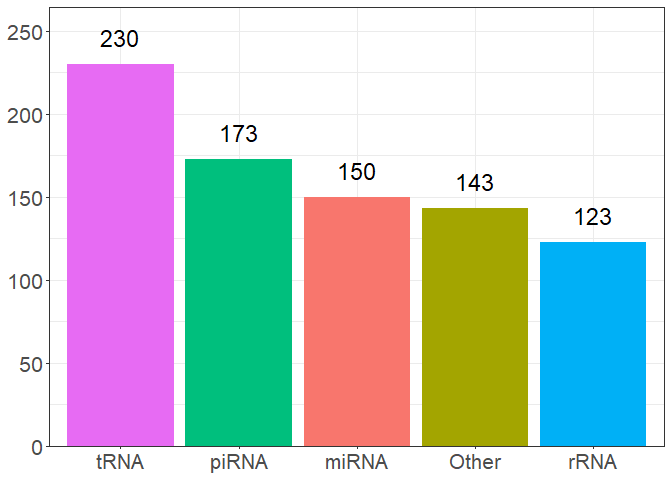
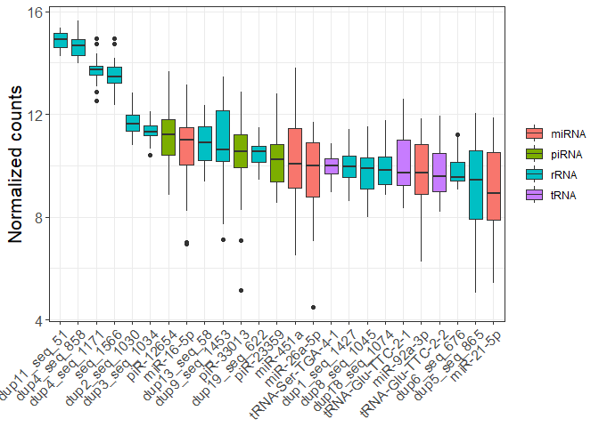
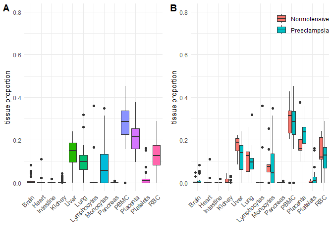
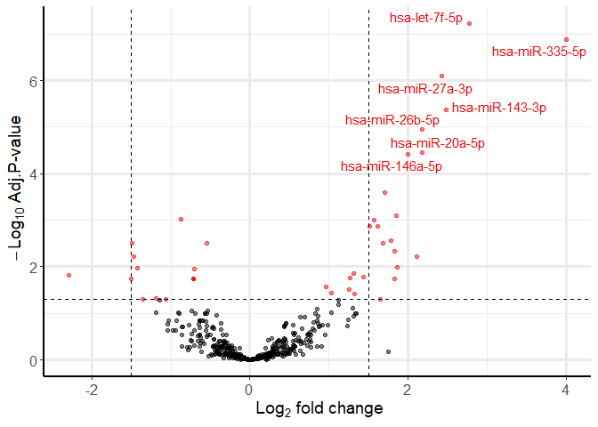
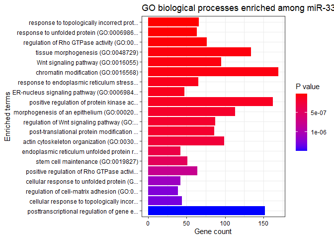

## R Markdown

This is an R Markdown documenting the processing of sncRNAseq data from
extracellular vesicles (EVs) isolated from Motherhealth plasma samples
collected postpartum. The study profiled preelampsia cases (n=26) and
normotensive controls (n=13). EVs were isolated using IZON SEC columns.
RNA was extracted using the miRNeasy isolation kit. Out of 39 samples
sent to RealSeq for small RNAseq, 35 were successfully sequenced. FASTQ
files were received with adapters trimmed. The reads were aligned using
STAR version 2.7.10b using the gencode v43 human reference genome
(hg38). Counts were generated using the featureCounts function of
Rsubread 2.12.3. Features were annotated for sRNAs using the ITAS
database following the workflow outlined by Stupnikov et al., 2022:
<https://github.com/EpiEpiMSU/ITAS>. Using this workflow, 18948 sRNA
elements were detected.

Low abundant reads were filtered with a cutoff of mean count \> 5, with
819 elements remaining (<https://www.mdpi.com/1422-0067/24/4/4195>). The
most abundant snRNA features were miRNA (n=150), Other (n=143), piRNA
(n=173), rRNA (n=123), and tRNA (n=230). CIBERSORT was conducted to
ennumerate EV cell-type contributions using a published miRNA tissue
reference dataset(Srinivasan et al., 2020; <PMID:32864636>) Differential
expression of 26 snRNAs were identified at an FDR \< 0.05 comparing
preeclampsia cases vs. controls, adjusting for 3 surrogate variables ,
gestational age, and maternal BMI.

## Load Covariate data

``` r
Covariates<-readRDS("../../../../../Data/Covariates/Covariates_pilot.rds")

CIBERSORT_reference<-readRDS("C:/Users/mk2583/OneDrive - cumc.columbia.edu/Deyssenroth_Lab/Tutorials/miRNATissueAtlas_CIBERSORT/miRNA_reference.rds")
```

## Clean-up covariate data

``` r
Covariates<-Covariates%>%
  droplevels()
```

## Demotable

``` r
demo<-Covariates%>%
  mutate(BMI=ifelse(BMI=="obese",paste0(intToUtf8(8805),"30"),"<30"),
         delivery_mode=ifelse(delivery_mode=="C/S","C-Section","Vaginal"))%>%
  dplyr::select(Group,Collection_interval,BMI,delivery_mode,Gest.age,Race.ethnicity)%>%
tbl_summary(
    by = Group,
    statistic = list(all_continuous()  ~ "{mean} ({sd})",
                     all_categorical() ~ "{n}    ({p}%)"),
    digits = list(all_continuous()  ~ c(2, 2),
                  all_categorical() ~ c(0, 1)),
    type = list(Collection_interval ~ "continuous",
                BMI ~ "categorical",
                Race.ethnicity ~ "categorical",
                delivery_mode ~ "categorical",
                Gest.age ~ "continuous"),
    label  = list(Collection_interval ~ "Time to collection (days)",
                BMI ~ paste0("Maternal BMI kg/m",supsc("2")),
                Race.ethnicity ~ "Race/ethnicity",
                delivery_mode ~ "Delivery Mode",
                Gest.age ~ "Gestational age (weeks)")
  ) %>%
  add_p(pvalue_fun = ~ style_pvalue(.x, digits = 2)) %>%
  modify_header(label = "**Variable**",
                all_stat_cols() ~ "**{level}**<br>N = {n} ({style_percent(p, digits=1)}%)") %>%
  bold_labels() %>%
  modify_caption("<div style='text-align: left; font-weight: bold;'>Table1. Motherhealth participant characteristics</div>")

knitr::knit_print(demo)
```

<div id="lojqmnendl" style="padding-left:0px;padding-right:0px;padding-top:10px;padding-bottom:10px;overflow-x:auto;overflow-y:auto;width:auto;height:auto;">
<style>#lojqmnendl table {
  font-family: system-ui, 'Segoe UI', Roboto, Helvetica, Arial, sans-serif, 'Apple Color Emoji', 'Segoe UI Emoji', 'Segoe UI Symbol', 'Noto Color Emoji';
  -webkit-font-smoothing: antialiased;
  -moz-osx-font-smoothing: grayscale;
}

#lojqmnendl thead, #lojqmnendl tbody, #lojqmnendl tfoot, #lojqmnendl tr, #lojqmnendl td, #lojqmnendl th {
  border-style: none;
}

#lojqmnendl p {
  margin: 0;
  padding: 0;
}

#lojqmnendl .gt_table {
  display: table;
  border-collapse: collapse;
  line-height: normal;
  margin-left: auto;
  margin-right: auto;
  color: #333333;
  font-size: 16px;
  font-weight: normal;
  font-style: normal;
  background-color: #FFFFFF;
  width: auto;
  border-top-style: solid;
  border-top-width: 2px;
  border-top-color: #A8A8A8;
  border-right-style: none;
  border-right-width: 2px;
  border-right-color: #D3D3D3;
  border-bottom-style: solid;
  border-bottom-width: 2px;
  border-bottom-color: #A8A8A8;
  border-left-style: none;
  border-left-width: 2px;
  border-left-color: #D3D3D3;
}

#lojqmnendl .gt_caption {
  padding-top: 4px;
  padding-bottom: 4px;
}

#lojqmnendl .gt_title {
  color: #333333;
  font-size: 125%;
  font-weight: initial;
  padding-top: 4px;
  padding-bottom: 4px;
  padding-left: 5px;
  padding-right: 5px;
  border-bottom-color: #FFFFFF;
  border-bottom-width: 0;
}

#lojqmnendl .gt_subtitle {
  color: #333333;
  font-size: 85%;
  font-weight: initial;
  padding-top: 3px;
  padding-bottom: 5px;
  padding-left: 5px;
  padding-right: 5px;
  border-top-color: #FFFFFF;
  border-top-width: 0;
}

#lojqmnendl .gt_heading {
  background-color: #FFFFFF;
  text-align: center;
  border-bottom-color: #FFFFFF;
  border-left-style: none;
  border-left-width: 1px;
  border-left-color: #D3D3D3;
  border-right-style: none;
  border-right-width: 1px;
  border-right-color: #D3D3D3;
}

#lojqmnendl .gt_bottom_border {
  border-bottom-style: solid;
  border-bottom-width: 2px;
  border-bottom-color: #D3D3D3;
}

#lojqmnendl .gt_col_headings {
  border-top-style: solid;
  border-top-width: 2px;
  border-top-color: #D3D3D3;
  border-bottom-style: solid;
  border-bottom-width: 2px;
  border-bottom-color: #D3D3D3;
  border-left-style: none;
  border-left-width: 1px;
  border-left-color: #D3D3D3;
  border-right-style: none;
  border-right-width: 1px;
  border-right-color: #D3D3D3;
}

#lojqmnendl .gt_col_heading {
  color: #333333;
  background-color: #FFFFFF;
  font-size: 100%;
  font-weight: normal;
  text-transform: inherit;
  border-left-style: none;
  border-left-width: 1px;
  border-left-color: #D3D3D3;
  border-right-style: none;
  border-right-width: 1px;
  border-right-color: #D3D3D3;
  vertical-align: bottom;
  padding-top: 5px;
  padding-bottom: 6px;
  padding-left: 5px;
  padding-right: 5px;
  overflow-x: hidden;
}

#lojqmnendl .gt_column_spanner_outer {
  color: #333333;
  background-color: #FFFFFF;
  font-size: 100%;
  font-weight: normal;
  text-transform: inherit;
  padding-top: 0;
  padding-bottom: 0;
  padding-left: 4px;
  padding-right: 4px;
}

#lojqmnendl .gt_column_spanner_outer:first-child {
  padding-left: 0;
}

#lojqmnendl .gt_column_spanner_outer:last-child {
  padding-right: 0;
}

#lojqmnendl .gt_column_spanner {
  border-bottom-style: solid;
  border-bottom-width: 2px;
  border-bottom-color: #D3D3D3;
  vertical-align: bottom;
  padding-top: 5px;
  padding-bottom: 5px;
  overflow-x: hidden;
  display: inline-block;
  width: 100%;
}

#lojqmnendl .gt_spanner_row {
  border-bottom-style: hidden;
}

#lojqmnendl .gt_group_heading {
  padding-top: 8px;
  padding-bottom: 8px;
  padding-left: 5px;
  padding-right: 5px;
  color: #333333;
  background-color: #FFFFFF;
  font-size: 100%;
  font-weight: initial;
  text-transform: inherit;
  border-top-style: solid;
  border-top-width: 2px;
  border-top-color: #D3D3D3;
  border-bottom-style: solid;
  border-bottom-width: 2px;
  border-bottom-color: #D3D3D3;
  border-left-style: none;
  border-left-width: 1px;
  border-left-color: #D3D3D3;
  border-right-style: none;
  border-right-width: 1px;
  border-right-color: #D3D3D3;
  vertical-align: middle;
  text-align: left;
}

#lojqmnendl .gt_empty_group_heading {
  padding: 0.5px;
  color: #333333;
  background-color: #FFFFFF;
  font-size: 100%;
  font-weight: initial;
  border-top-style: solid;
  border-top-width: 2px;
  border-top-color: #D3D3D3;
  border-bottom-style: solid;
  border-bottom-width: 2px;
  border-bottom-color: #D3D3D3;
  vertical-align: middle;
}

#lojqmnendl .gt_from_md > :first-child {
  margin-top: 0;
}

#lojqmnendl .gt_from_md > :last-child {
  margin-bottom: 0;
}

#lojqmnendl .gt_row {
  padding-top: 8px;
  padding-bottom: 8px;
  padding-left: 5px;
  padding-right: 5px;
  margin: 10px;
  border-top-style: solid;
  border-top-width: 1px;
  border-top-color: #D3D3D3;
  border-left-style: none;
  border-left-width: 1px;
  border-left-color: #D3D3D3;
  border-right-style: none;
  border-right-width: 1px;
  border-right-color: #D3D3D3;
  vertical-align: middle;
  overflow-x: hidden;
}

#lojqmnendl .gt_stub {
  color: #333333;
  background-color: #FFFFFF;
  font-size: 100%;
  font-weight: initial;
  text-transform: inherit;
  border-right-style: solid;
  border-right-width: 2px;
  border-right-color: #D3D3D3;
  padding-left: 5px;
  padding-right: 5px;
}

#lojqmnendl .gt_stub_row_group {
  color: #333333;
  background-color: #FFFFFF;
  font-size: 100%;
  font-weight: initial;
  text-transform: inherit;
  border-right-style: solid;
  border-right-width: 2px;
  border-right-color: #D3D3D3;
  padding-left: 5px;
  padding-right: 5px;
  vertical-align: top;
}

#lojqmnendl .gt_row_group_first td {
  border-top-width: 2px;
}

#lojqmnendl .gt_row_group_first th {
  border-top-width: 2px;
}

#lojqmnendl .gt_summary_row {
  color: #333333;
  background-color: #FFFFFF;
  text-transform: inherit;
  padding-top: 8px;
  padding-bottom: 8px;
  padding-left: 5px;
  padding-right: 5px;
}

#lojqmnendl .gt_first_summary_row {
  border-top-style: solid;
  border-top-color: #D3D3D3;
}

#lojqmnendl .gt_first_summary_row.thick {
  border-top-width: 2px;
}

#lojqmnendl .gt_last_summary_row {
  padding-top: 8px;
  padding-bottom: 8px;
  padding-left: 5px;
  padding-right: 5px;
  border-bottom-style: solid;
  border-bottom-width: 2px;
  border-bottom-color: #D3D3D3;
}

#lojqmnendl .gt_grand_summary_row {
  color: #333333;
  background-color: #FFFFFF;
  text-transform: inherit;
  padding-top: 8px;
  padding-bottom: 8px;
  padding-left: 5px;
  padding-right: 5px;
}

#lojqmnendl .gt_first_grand_summary_row {
  padding-top: 8px;
  padding-bottom: 8px;
  padding-left: 5px;
  padding-right: 5px;
  border-top-style: double;
  border-top-width: 6px;
  border-top-color: #D3D3D3;
}

#lojqmnendl .gt_last_grand_summary_row_top {
  padding-top: 8px;
  padding-bottom: 8px;
  padding-left: 5px;
  padding-right: 5px;
  border-bottom-style: double;
  border-bottom-width: 6px;
  border-bottom-color: #D3D3D3;
}

#lojqmnendl .gt_striped {
  background-color: rgba(128, 128, 128, 0.05);
}

#lojqmnendl .gt_table_body {
  border-top-style: solid;
  border-top-width: 2px;
  border-top-color: #D3D3D3;
  border-bottom-style: solid;
  border-bottom-width: 2px;
  border-bottom-color: #D3D3D3;
}

#lojqmnendl .gt_footnotes {
  color: #333333;
  background-color: #FFFFFF;
  border-bottom-style: none;
  border-bottom-width: 2px;
  border-bottom-color: #D3D3D3;
  border-left-style: none;
  border-left-width: 2px;
  border-left-color: #D3D3D3;
  border-right-style: none;
  border-right-width: 2px;
  border-right-color: #D3D3D3;
}

#lojqmnendl .gt_footnote {
  margin: 0px;
  font-size: 90%;
  padding-top: 4px;
  padding-bottom: 4px;
  padding-left: 5px;
  padding-right: 5px;
}

#lojqmnendl .gt_sourcenotes {
  color: #333333;
  background-color: #FFFFFF;
  border-bottom-style: none;
  border-bottom-width: 2px;
  border-bottom-color: #D3D3D3;
  border-left-style: none;
  border-left-width: 2px;
  border-left-color: #D3D3D3;
  border-right-style: none;
  border-right-width: 2px;
  border-right-color: #D3D3D3;
}

#lojqmnendl .gt_sourcenote {
  font-size: 90%;
  padding-top: 4px;
  padding-bottom: 4px;
  padding-left: 5px;
  padding-right: 5px;
}

#lojqmnendl .gt_left {
  text-align: left;
}

#lojqmnendl .gt_center {
  text-align: center;
}

#lojqmnendl .gt_right {
  text-align: right;
  font-variant-numeric: tabular-nums;
}

#lojqmnendl .gt_font_normal {
  font-weight: normal;
}

#lojqmnendl .gt_font_bold {
  font-weight: bold;
}

#lojqmnendl .gt_font_italic {
  font-style: italic;
}

#lojqmnendl .gt_super {
  font-size: 65%;
}

#lojqmnendl .gt_footnote_marks {
  font-size: 75%;
  vertical-align: 0.4em;
  position: initial;
}

#lojqmnendl .gt_asterisk {
  font-size: 100%;
  vertical-align: 0;
}

#lojqmnendl .gt_indent_1 {
  text-indent: 5px;
}

#lojqmnendl .gt_indent_2 {
  text-indent: 10px;
}

#lojqmnendl .gt_indent_3 {
  text-indent: 15px;
}

#lojqmnendl .gt_indent_4 {
  text-indent: 20px;
}

#lojqmnendl .gt_indent_5 {
  text-indent: 25px;
}
</style>
<table class="gt_table" data-quarto-disable-processing="false" data-quarto-bootstrap="false">
  <caption><div style='text-align: left; font-weight: bold;'>Table1. Motherhealth participant characteristics</div>
</caption>
  <thead>
    
    <tr class="gt_col_headings">
      <th class="gt_col_heading gt_columns_bottom_border gt_left" rowspan="1" colspan="1" scope="col" id="&lt;strong&gt;Variable&lt;/strong&gt;"><strong>Variable</strong></th>
      <th class="gt_col_heading gt_columns_bottom_border gt_center" rowspan="1" colspan="1" scope="col" id="&lt;strong&gt;Normotensive&lt;/strong&gt;&lt;br&gt;N = 9 (25.7%)&lt;span class=&quot;gt_footnote_marks&quot; style=&quot;white-space:nowrap;font-style:italic;font-weight:normal;&quot;&gt;&lt;sup&gt;1&lt;/sup&gt;&lt;/span&gt;"><strong>Normotensive</strong><br>N = 9 (25.7%)<span class="gt_footnote_marks" style="white-space:nowrap;font-style:italic;font-weight:normal;"><sup>1</sup></span></th>
      <th class="gt_col_heading gt_columns_bottom_border gt_center" rowspan="1" colspan="1" scope="col" id="&lt;strong&gt;Preeclampsia&lt;/strong&gt;&lt;br&gt;N = 26 (74.3%)&lt;span class=&quot;gt_footnote_marks&quot; style=&quot;white-space:nowrap;font-style:italic;font-weight:normal;&quot;&gt;&lt;sup&gt;1&lt;/sup&gt;&lt;/span&gt;"><strong>Preeclampsia</strong><br>N = 26 (74.3%)<span class="gt_footnote_marks" style="white-space:nowrap;font-style:italic;font-weight:normal;"><sup>1</sup></span></th>
      <th class="gt_col_heading gt_columns_bottom_border gt_center" rowspan="1" colspan="1" scope="col" id="&lt;strong&gt;p-value&lt;/strong&gt;&lt;span class=&quot;gt_footnote_marks&quot; style=&quot;white-space:nowrap;font-style:italic;font-weight:normal;&quot;&gt;&lt;sup&gt;2&lt;/sup&gt;&lt;/span&gt;"><strong>p-value</strong><span class="gt_footnote_marks" style="white-space:nowrap;font-style:italic;font-weight:normal;"><sup>2</sup></span></th>
    </tr>
  </thead>
  <tbody class="gt_table_body">
    <tr><td headers="label" class="gt_row gt_left" style="font-weight: bold;">Time to collection (days)</td>
<td headers="stat_1" class="gt_row gt_center">1.33 (0.71)</td>
<td headers="stat_2" class="gt_row gt_center">2.15 (1.32)</td>
<td headers="p.value" class="gt_row gt_center">0.10</td></tr>
    <tr><td headers="label" class="gt_row gt_left" style="font-weight: bold;">Maternal BMI kg/m²</td>
<td headers="stat_1" class="gt_row gt_center"></td>
<td headers="stat_2" class="gt_row gt_center"></td>
<td headers="p.value" class="gt_row gt_center">0.018</td></tr>
    <tr><td headers="label" class="gt_row gt_left">    &lt;30</td>
<td headers="stat_1" class="gt_row gt_center">8    (88.9%)</td>
<td headers="stat_2" class="gt_row gt_center">10    (38.5%)</td>
<td headers="p.value" class="gt_row gt_center"></td></tr>
    <tr><td headers="label" class="gt_row gt_left">    ≥30</td>
<td headers="stat_1" class="gt_row gt_center">1    (11.1%)</td>
<td headers="stat_2" class="gt_row gt_center">16    (61.5%)</td>
<td headers="p.value" class="gt_row gt_center"></td></tr>
    <tr><td headers="label" class="gt_row gt_left" style="font-weight: bold;">Delivery Mode</td>
<td headers="stat_1" class="gt_row gt_center"></td>
<td headers="stat_2" class="gt_row gt_center"></td>
<td headers="p.value" class="gt_row gt_center">0.26</td></tr>
    <tr><td headers="label" class="gt_row gt_left">    C-Section</td>
<td headers="stat_1" class="gt_row gt_center">3    (33.3%)</td>
<td headers="stat_2" class="gt_row gt_center">15    (57.7%)</td>
<td headers="p.value" class="gt_row gt_center"></td></tr>
    <tr><td headers="label" class="gt_row gt_left">    Vaginal</td>
<td headers="stat_1" class="gt_row gt_center">6    (66.7%)</td>
<td headers="stat_2" class="gt_row gt_center">11    (42.3%)</td>
<td headers="p.value" class="gt_row gt_center"></td></tr>
    <tr><td headers="label" class="gt_row gt_left" style="font-weight: bold;">Gestational age (weeks)</td>
<td headers="stat_1" class="gt_row gt_center">39.24 (0.93)</td>
<td headers="stat_2" class="gt_row gt_center">35.00 (2.84)</td>
<td headers="p.value" class="gt_row gt_center"><0.001</td></tr>
    <tr><td headers="label" class="gt_row gt_left" style="font-weight: bold;">Race/ethnicity</td>
<td headers="stat_1" class="gt_row gt_center"></td>
<td headers="stat_2" class="gt_row gt_center"></td>
<td headers="p.value" class="gt_row gt_center">0.58</td></tr>
    <tr><td headers="label" class="gt_row gt_left">    Non-Hispanic White</td>
<td headers="stat_1" class="gt_row gt_center">3    (37.5%)</td>
<td headers="stat_2" class="gt_row gt_center">6    (24.0%)</td>
<td headers="p.value" class="gt_row gt_center"></td></tr>
    <tr><td headers="label" class="gt_row gt_left">    Hispanic</td>
<td headers="stat_1" class="gt_row gt_center">4    (50.0%)</td>
<td headers="stat_2" class="gt_row gt_center">17    (68.0%)</td>
<td headers="p.value" class="gt_row gt_center"></td></tr>
    <tr><td headers="label" class="gt_row gt_left">    Black</td>
<td headers="stat_1" class="gt_row gt_center">1    (12.5%)</td>
<td headers="stat_2" class="gt_row gt_center">2    (8.0%)</td>
<td headers="p.value" class="gt_row gt_center"></td></tr>
    <tr><td headers="label" class="gt_row gt_left">    Unknown</td>
<td headers="stat_1" class="gt_row gt_center">1</td>
<td headers="stat_2" class="gt_row gt_center">1</td>
<td headers="p.value" class="gt_row gt_center"></td></tr>
  </tbody>
  
  <tfoot class="gt_footnotes">
    <tr>
      <td class="gt_footnote" colspan="4"><span class="gt_footnote_marks" style="white-space:nowrap;font-style:italic;font-weight:normal;"><sup>1</sup></span> Mean (SD); n    (%)</td>
    </tr>
    <tr>
      <td class="gt_footnote" colspan="4"><span class="gt_footnote_marks" style="white-space:nowrap;font-style:italic;font-weight:normal;"><sup>2</sup></span> Wilcoxon rank sum test; Fisher’s exact test</td>
    </tr>
  </tfoot>
</table>
</div>

``` r
Demo_table_study_csv<-demo%>%
 as_tibble() 

#save table  
write.csv(Demo_table_study_csv, "../../Manuscript/Tables/Table1_demographics.csv")
```

# Find file locations of bam files

``` r
# Function to recursively search for files with specific extensions
find_files <- function(directory, extensions) {
  files <- dir_ls(directory, recurse = TRUE)
  filtered_files <- files[str_detect(files, paste0("\\.", extensions, "$"))]
  as.character(filtered_files)
}

# path to directory
directory <- "../../../../../Data/RNAseq/STAR/STAR_align_clean"

# Replace with the directory you want to search in
extensions <- c("bam")     # Replace with the desired extensions

file_locations <- find_files(directory, extensions)
#print(file_locations)
file.exists(file_locations)
```

    ##  [1] TRUE TRUE TRUE TRUE TRUE TRUE TRUE TRUE TRUE TRUE TRUE TRUE TRUE TRUE TRUE
    ## [16] TRUE TRUE TRUE TRUE TRUE TRUE TRUE TRUE TRUE TRUE TRUE TRUE TRUE TRUE TRUE
    ## [31] TRUE TRUE TRUE TRUE TRUE

``` r
#35 files found
```

## Count features and annotate snRNAs

``` r
# count and annotate snrna features 
gtffile <- file.path("../../../../../Data/RNAseq/ITAS/Integrated_annotation/human/human_allRNA/human_allRNA.gtf")

fc<-featureCounts(files=file_locations, 
                  annot.ext=gtffile, 
                  isGTFAnnotationFile = TRUE, 
                  GTF.featureType = "exon", 
                  GTF.attrType = "transcript_id", 
                  minFragLength=15,
                  isPairedEnd=FALSE)
```

    ## 
    ##         ==========     _____ _    _ ____  _____  ______          _____  
    ##         =====         / ____| |  | |  _ \|  __ \|  ____|   /\   |  __ \ 
    ##           =====      | (___ | |  | | |_) | |__) | |__     /  \  | |  | |
    ##             ====      \___ \| |  | |  _ <|  _  /|  __|   / /\ \ | |  | |
    ##               ====    ____) | |__| | |_) | | \ \| |____ / ____ \| |__| |
    ##         ==========   |_____/ \____/|____/|_|  \_\______/_/    \_\_____/
    ##        Rsubread 2.12.3
    ## 
    ## //========================== featureCounts setting ===========================\\
    ## ||                                                                            ||
    ## ||             Input files : 35 BAM files                                     ||
    ## ||                                                                            ||
    ## ||                           RSB477-01Aligned.sortedByCoord.out.bam           ||
    ## ||                           RSB477-02Aligned.sortedByCoord.out.bam           ||
    ## ||                           RSB477-03Aligned.sortedByCoord.out.bam           ||
    ## ||                           RSB477-04Aligned.sortedByCoord.out.bam           ||
    ## ||                           RSB477-05Aligned.sortedByCoord.out.bam           ||
    ## ||                           RSB477-06Aligned.sortedByCoord.out.bam           ||
    ## ||                           RSB477-07Aligned.sortedByCoord.out.bam           ||
    ## ||                           RSB477-08Aligned.sortedByCoord.out.bam           ||
    ## ||                           RSB477-09Aligned.sortedByCoord.out.bam           ||
    ## ||                           RSB477-11Aligned.sortedByCoord.out.bam           ||
    ## ||                           RSB477-12Aligned.sortedByCoord.out.bam           ||
    ## ||                           RSB477-13Aligned.sortedByCoord.out.bam           ||
    ## ||                           RSB477-14Aligned.sortedByCoord.out.bam           ||
    ## ||                           RSB477-15Aligned.sortedByCoord.out.bam           ||
    ## ||                           RSB478-02Aligned.sortedByCoord.out.bam           ||
    ## ||                           RSB478-03Aligned.sortedByCoord.out.bam           ||
    ## ||                           RSB478-04Aligned.sortedByCoord.out.bam           ||
    ## ||                           RSB478-05Aligned.sortedByCoord.out.bam           ||
    ## ||                           RSB478-06Aligned.sortedByCoord.out.bam           ||
    ## ||                           RSB478-07Aligned.sortedByCoord.out.bam           ||
    ## ||                           RSB478-08Aligned.sortedByCoord.out.bam           ||
    ## ||                           RSB478-10Aligned.sortedByCoord.out.bam           ||
    ## ||                           RSB478-11Aligned.sortedByCoord.out.bam           ||
    ## ||                           RSB478-13Aligned.sortedByCoord.out.bam           ||
    ## ||                           RSB478-14Aligned.sortedByCoord.out.bam           ||
    ## ||                           RSB478-15Aligned.sortedByCoord.out.bam           ||
    ## ||                           RSB478-16Aligned.sortedByCoord.out.bam           ||
    ## ||                           RSB478-17Aligned.sortedByCoord.out.bam           ||
    ## ||                           RSB478-18Aligned.sortedByCoord.out.bam           ||
    ## ||                           RSB478-19Aligned.sortedByCoord.out.bam           ||
    ## ||                           RSB478-20Aligned.sortedByCoord.out.bam           ||
    ## ||                           RSB478-21Aligned.sortedByCoord.out.bam           ||
    ## ||                           RSB478-22Aligned.sortedByCoord.out.bam           ||
    ## ||                           RSB478-23Aligned.sortedByCoord.out.bam           ||
    ## ||                           RSB478-24Aligned.sortedByCoord.out.bam           ||
    ## ||                                                                            ||
    ## ||              Paired-end : no                                               ||
    ## ||        Count read pairs : no                                               ||
    ## ||              Annotation : human_allRNA.gtf (GTF)                           ||
    ## ||      Dir for temp files : .                                                ||
    ## ||                 Threads : 1                                                ||
    ## ||                   Level : meta-feature level                               ||
    ## ||      Multimapping reads : counted                                          ||
    ## || Multi-overlapping reads : not counted                                      ||
    ## ||   Min overlapping bases : 1                                                ||
    ## ||                                                                            ||
    ## \\============================================================================//
    ## 
    ## //================================= Running ==================================\\
    ## ||                                                                            ||
    ## || Load annotation file human_allRNA.gtf ...                                  ||
    ## ||    Features : 426717                                                       ||
    ## ||    Meta-features : 18948                                                   ||
    ## ||    Chromosomes/contigs : 88                                                ||
    ## ||                                                                            ||
    ## || Process BAM file RSB477-01Aligned.sortedByCoord.out.bam...                 ||
    ## ||    Single-end reads are included.                                          ||
    ## ||    Total alignments : 11628529                                             ||
    ## ||    Successfully assigned alignments : 243778 (2.1%)                        ||
    ## ||    Running time : 0.30 minutes                                             ||
    ## ||                                                                            ||
    ## || Process BAM file RSB477-02Aligned.sortedByCoord.out.bam...                 ||
    ## ||    Single-end reads are included.                                          ||
    ## ||    Total alignments : 18221519                                             ||
    ## ||    Successfully assigned alignments : 353206 (1.9%)                        ||
    ## ||    Running time : 0.38 minutes                                             ||
    ## ||                                                                            ||
    ## || Process BAM file RSB477-03Aligned.sortedByCoord.out.bam...                 ||
    ## ||    Single-end reads are included.                                          ||
    ## ||    Total alignments : 6938943                                              ||
    ## ||    Successfully assigned alignments : 101348 (1.5%)                        ||
    ## ||    Running time : 0.13 minutes                                             ||
    ## ||                                                                            ||
    ## || Process BAM file RSB477-04Aligned.sortedByCoord.out.bam...                 ||
    ## ||    Single-end reads are included.                                          ||
    ## ||    Total alignments : 9713554                                              ||
    ## ||    Successfully assigned alignments : 180513 (1.9%)                        ||
    ## ||    Running time : 0.22 minutes                                             ||
    ## ||                                                                            ||
    ## || Process BAM file RSB477-05Aligned.sortedByCoord.out.bam...                 ||
    ## ||    Single-end reads are included.                                          ||
    ## ||    Total alignments : 10547497                                             ||
    ## ||    Successfully assigned alignments : 152245 (1.4%)                        ||
    ## ||    Running time : 0.15 minutes                                             ||
    ## ||                                                                            ||
    ## || Process BAM file RSB477-06Aligned.sortedByCoord.out.bam...                 ||
    ## ||    Single-end reads are included.                                          ||
    ## ||    Total alignments : 14861154                                             ||
    ## ||    Successfully assigned alignments : 216544 (1.5%)                        ||
    ## ||    Running time : 0.25 minutes                                             ||
    ## ||                                                                            ||
    ## || Process BAM file RSB477-07Aligned.sortedByCoord.out.bam...                 ||
    ## ||    Single-end reads are included.                                          ||
    ## ||    Total alignments : 15601012                                             ||
    ## ||    Successfully assigned alignments : 227306 (1.5%)                        ||
    ## ||    Running time : 0.27 minutes                                             ||
    ## ||                                                                            ||
    ## || Process BAM file RSB477-08Aligned.sortedByCoord.out.bam...                 ||
    ## ||    Single-end reads are included.                                          ||
    ## ||    Total alignments : 16433207                                             ||
    ## ||    Successfully assigned alignments : 217884 (1.3%)                        ||
    ## ||    Running time : 0.34 minutes                                             ||
    ## ||                                                                            ||
    ## || Process BAM file RSB477-09Aligned.sortedByCoord.out.bam...                 ||
    ## ||    Single-end reads are included.                                          ||
    ## ||    Total alignments : 11251369                                             ||
    ## ||    Successfully assigned alignments : 160437 (1.4%)                        ||
    ## ||    Running time : 0.17 minutes                                             ||
    ## ||                                                                            ||
    ## || Process BAM file RSB477-11Aligned.sortedByCoord.out.bam...                 ||
    ## ||    Single-end reads are included.                                          ||
    ## ||    Total alignments : 6924117                                              ||
    ## ||    Successfully assigned alignments : 128008 (1.8%)                        ||
    ## ||    Running time : 0.12 minutes                                             ||
    ## ||                                                                            ||
    ## || Process BAM file RSB477-12Aligned.sortedByCoord.out.bam...                 ||
    ## ||    Single-end reads are included.                                          ||
    ## ||    Total alignments : 11599110                                             ||
    ## ||    Successfully assigned alignments : 218529 (1.9%)                        ||
    ## ||    Running time : 0.19 minutes                                             ||
    ## ||                                                                            ||
    ## || Process BAM file RSB477-13Aligned.sortedByCoord.out.bam...                 ||
    ## ||    Single-end reads are included.                                          ||
    ## ||    Total alignments : 7896582                                              ||
    ## ||    Successfully assigned alignments : 152504 (1.9%)                        ||
    ## ||    Running time : 0.14 minutes                                             ||
    ## ||                                                                            ||
    ## || Process BAM file RSB477-14Aligned.sortedByCoord.out.bam...                 ||
    ## ||    Single-end reads are included.                                          ||
    ## ||    Total alignments : 11518846                                             ||
    ## ||    Successfully assigned alignments : 229510 (2.0%)                        ||
    ## ||    Running time : 0.21 minutes                                             ||
    ## ||                                                                            ||
    ## || Process BAM file RSB477-15Aligned.sortedByCoord.out.bam...                 ||
    ## ||    Single-end reads are included.                                          ||
    ## ||    Total alignments : 11714408                                             ||
    ## ||    Successfully assigned alignments : 224134 (1.9%)                        ||
    ## ||    Running time : 0.18 minutes                                             ||
    ## ||                                                                            ||
    ## || Process BAM file RSB478-02Aligned.sortedByCoord.out.bam...                 ||
    ## ||    Single-end reads are included.                                          ||
    ## ||    Total alignments : 10913015                                             ||
    ## ||    Successfully assigned alignments : 207192 (1.9%)                        ||
    ## ||    Running time : 0.14 minutes                                             ||
    ## ||                                                                            ||
    ## || Process BAM file RSB478-03Aligned.sortedByCoord.out.bam...                 ||
    ## ||    Single-end reads are included.                                          ||
    ## ||    Total alignments : 13961462                                             ||
    ## ||    Successfully assigned alignments : 217427 (1.6%)                        ||
    ## ||    Running time : 0.19 minutes                                             ||
    ## ||                                                                            ||
    ## || Process BAM file RSB478-04Aligned.sortedByCoord.out.bam...                 ||
    ## ||    Single-end reads are included.                                          ||
    ## ||    Total alignments : 8161304                                              ||
    ## ||    Successfully assigned alignments : 193382 (2.4%)                        ||
    ## ||    Running time : 0.11 minutes                                             ||
    ## ||                                                                            ||
    ## || Process BAM file RSB478-05Aligned.sortedByCoord.out.bam...                 ||
    ## ||    Single-end reads are included.                                          ||
    ## ||    Total alignments : 10395915                                             ||
    ## ||    Successfully assigned alignments : 174513 (1.7%)                        ||
    ## ||    Running time : 0.13 minutes                                             ||
    ## ||                                                                            ||
    ## || Process BAM file RSB478-06Aligned.sortedByCoord.out.bam...                 ||
    ## ||    Single-end reads are included.                                          ||
    ## ||    Total alignments : 9434826                                              ||
    ## ||    Successfully assigned alignments : 148564 (1.6%)                        ||
    ## ||    Running time : 0.13 minutes                                             ||
    ## ||                                                                            ||
    ## || Process BAM file RSB478-07Aligned.sortedByCoord.out.bam...                 ||
    ## ||    Single-end reads are included.                                          ||
    ## ||    Total alignments : 11241862                                             ||
    ## ||    Successfully assigned alignments : 200888 (1.8%)                        ||
    ## ||    Running time : 0.14 minutes                                             ||
    ## ||                                                                            ||
    ## || Process BAM file RSB478-08Aligned.sortedByCoord.out.bam...                 ||
    ## ||    Single-end reads are included.                                          ||
    ## ||    Total alignments : 10758428                                             ||
    ## ||    Successfully assigned alignments : 160869 (1.5%)                        ||
    ## ||    Running time : 0.15 minutes                                             ||
    ## ||                                                                            ||
    ## || Process BAM file RSB478-10Aligned.sortedByCoord.out.bam...                 ||
    ## ||    Single-end reads are included.                                          ||
    ## ||    Total alignments : 10823416                                             ||
    ## ||    Successfully assigned alignments : 204729 (1.9%)                        ||
    ## ||    Running time : 0.14 minutes                                             ||
    ## ||                                                                            ||
    ## || Process BAM file RSB478-11Aligned.sortedByCoord.out.bam...                 ||
    ## ||    Single-end reads are included.                                          ||
    ## ||    Total alignments : 11615573                                             ||
    ## ||    Successfully assigned alignments : 228596 (2.0%)                        ||
    ## ||    Running time : 0.17 minutes                                             ||
    ## ||                                                                            ||
    ## || Process BAM file RSB478-13Aligned.sortedByCoord.out.bam...                 ||
    ## ||    Single-end reads are included.                                          ||
    ## ||    Total alignments : 6299867                                              ||
    ## ||    Successfully assigned alignments : 128207 (2.0%)                        ||
    ## ||    Running time : 0.08 minutes                                             ||
    ## ||                                                                            ||
    ## || Process BAM file RSB478-14Aligned.sortedByCoord.out.bam...                 ||
    ## ||    Single-end reads are included.                                          ||
    ## ||    Total alignments : 9803408                                              ||
    ## ||    Successfully assigned alignments : 131660 (1.3%)                        ||
    ## ||    Running time : 0.13 minutes                                             ||
    ## ||                                                                            ||
    ## || Process BAM file RSB478-15Aligned.sortedByCoord.out.bam...                 ||
    ## ||    Single-end reads are included.                                          ||
    ## ||    Total alignments : 16342135                                             ||
    ## ||    Successfully assigned alignments : 336065 (2.1%)                        ||
    ## ||    Running time : 0.22 minutes                                             ||
    ## ||                                                                            ||
    ## || Process BAM file RSB478-16Aligned.sortedByCoord.out.bam...                 ||
    ## ||    Single-end reads are included.                                          ||
    ## ||    Total alignments : 10875569                                             ||
    ## ||    Successfully assigned alignments : 198072 (1.8%)                        ||
    ## ||    Running time : 0.14 minutes                                             ||
    ## ||                                                                            ||
    ## || Process BAM file RSB478-17Aligned.sortedByCoord.out.bam...                 ||
    ## ||    Single-end reads are included.                                          ||
    ## ||    Total alignments : 9750690                                              ||
    ## ||    Successfully assigned alignments : 181115 (1.9%)                        ||
    ## ||    Running time : 0.14 minutes                                             ||
    ## ||                                                                            ||
    ## || Process BAM file RSB478-18Aligned.sortedByCoord.out.bam...                 ||
    ## ||    Single-end reads are included.                                          ||
    ## ||    Total alignments : 14075446                                             ||
    ## ||    Successfully assigned alignments : 196110 (1.4%)                        ||
    ## ||    Running time : 0.20 minutes                                             ||
    ## ||                                                                            ||
    ## || Process BAM file RSB478-19Aligned.sortedByCoord.out.bam...                 ||
    ## ||    Single-end reads are included.                                          ||
    ## ||    Total alignments : 12244209                                             ||
    ## ||    Successfully assigned alignments : 198974 (1.6%)                        ||
    ## ||    Running time : 0.19 minutes                                             ||
    ## ||                                                                            ||
    ## || Process BAM file RSB478-20Aligned.sortedByCoord.out.bam...                 ||
    ## ||    Single-end reads are included.                                          ||
    ## ||    Total alignments : 15110862                                             ||
    ## ||    Successfully assigned alignments : 236269 (1.6%)                        ||
    ## ||    Running time : 0.20 minutes                                             ||
    ## ||                                                                            ||
    ## || Process BAM file RSB478-21Aligned.sortedByCoord.out.bam...                 ||
    ## ||    Single-end reads are included.                                          ||
    ## ||    Total alignments : 7191426                                              ||
    ## ||    Successfully assigned alignments : 127519 (1.8%)                        ||
    ## ||    Running time : 0.09 minutes                                             ||
    ## ||                                                                            ||
    ## || Process BAM file RSB478-22Aligned.sortedByCoord.out.bam...                 ||
    ## ||    Single-end reads are included.                                          ||
    ## ||    Total alignments : 23600883                                             ||
    ## ||    Successfully assigned alignments : 367845 (1.6%)                        ||
    ## ||    Running time : 0.31 minutes                                             ||
    ## ||                                                                            ||
    ## || Process BAM file RSB478-23Aligned.sortedByCoord.out.bam...                 ||
    ## ||    Single-end reads are included.                                          ||
    ## ||    Total alignments : 11947603                                             ||
    ## ||    Successfully assigned alignments : 188155 (1.6%)                        ||
    ## ||    Running time : 0.15 minutes                                             ||
    ## ||                                                                            ||
    ## || Process BAM file RSB478-24Aligned.sortedByCoord.out.bam...                 ||
    ## ||    Single-end reads are included.                                          ||
    ## ||    Total alignments : 9214729                                              ||
    ## ||    Successfully assigned alignments : 162595 (1.8%)                        ||
    ## ||    Running time : 0.13 minutes                                             ||
    ## ||                                                                            ||
    ## || Write the final count table.                                               ||
    ## || Write the read assignment summary.                                         ||
    ## ||                                                                            ||
    ## \\============================================================================//

## Create DESeq2 dataset

``` r
dds<-DESeqDataSetFromMatrix(countData=fc$counts,
                            colData=Covariates,
                            design= ~ Gest.age + BMI + Group)

dds
```

    ## class: DESeqDataSet 
    ## dim: 18948 35 
    ## metadata(1): version
    ## assays(1): counts
    ## rownames(18948): 5S_1675 5S_1676 ... tRX-Val-NNN-4-1 tRX-Val-NNN-5-1
    ## rowData names(0):
    ## colnames(35): RSB477-01Aligned.sortedByCoord.out.bam
    ##   RSB477-02Aligned.sortedByCoord.out.bam ...
    ##   RSB478-23Aligned.sortedByCoord.out.bam
    ##   RSB478-24Aligned.sortedByCoord.out.bam
    ## colData names(11): SID Group ... seqid bam

``` r
#class: DESeqDataSet 
#dim: 18948 35 
#metadata(1): version
#assays(1): counts
#rownames(18948): 5S_1675 5S_1676 ... tRX-Val-NNN-4-1 tRX-Val-NNN-5-1
#rowData names(0):
#colnames(35): RSB477-01Aligned.sortedByCoord.out.bam RSB477-02Aligned.sortedByCoord.out.bam ...
#  RSB478-23Aligned.sortedByCoord.out.bam RSB478-24Aligned.sortedByCoord.out.bam
#colData names(7): SID Group ... seqid bam

all(colnames(dds)==dds$bam) #TRUE
```

    ## [1] TRUE

## Pre-filtering

``` r
keep<-rowMeans(counts(dds)) >5
summary(keep) #819
```

    ##    Mode   FALSE    TRUE 
    ## logical   18129     819

``` r
dds<-dds[keep,]
```

## RNA species

``` r
#label RNA species
txdb_dds<-counts(dds)
  
txdb_dds<-txdb_dds%>%
  as.data.frame()%>%
  rownames_to_column("Gene")%>%
  mutate(TXTYPE=factor(ifelse(grepl("hsa-let|hsa-miR",Gene),"miRNA",
                            ifelse(grepl("piR",Gene),"piRNA",
                                   ifelse(grepl("rRNA",Gene),"rRNA",
                                      ifelse(grepl("tRNA",Gene),"tRNA","Other"))))))%>%
  dplyr::select(Gene,TXTYPE)

summary(factor(txdb_dds$TXTYPE))
```

    ## miRNA Other piRNA  rRNA  tRNA 
    ##   150   143   173   123   230

``` r
#miRNA Other piRNA  rRNA  tRNA 
#  150   143   173   123   230


RNA_profile<-ggplot(txdb_dds, aes(reorder(TXTYPE,TXTYPE,function(x)-length(x)),fill=TXTYPE))+
  geom_bar()+
  theme_bw()+
  geom_text(stat = "count", aes(label = after_stat(count)),vjust=-1,size=6)+
  scale_y_continuous(expand=expansion(mult=c(0,0.15)))+
  theme(axis.title=element_blank(),
    axis.text=element_text(size=16),
    legend.position = "none")

RNA_profile
```

<!-- -->

``` r
pdf("../../Manuscript/Plots/Figure1_sRNAbiotypes.pdf")
RNA_profile
dev.off()
```

    ## png 
    ##   2

## Normalize

``` r
dds<-DESeq(dds)
```

## Top most expressed genes

``` r
vsd <- varianceStabilizingTransformation(dds, blind = TRUE)
select<-order(rowMeans(counts(dds,normalized=TRUE)),
                decreasing=TRUE)[1:25]

top.genes<-assay(vsd)[select,]

top.gene.plot<-top.genes%>%
  as_tibble(.,rownames=NA)%>%
  rownames_to_column(var="sRNA")%>%
  mutate(type=ifelse(grepl("rRNA",sRNA),"rRNA",
                     ifelse(grepl("piR",sRNA),"piRNA",
                            ifelse(grepl("miR",sRNA),"miRNA","tRNA"))),
         sRNA=str_replace(sRNA,"^[^Hsa]*Hsa_",""),
         sRNA=str_replace(sRNA,"^[^hsa]*hsa-",""))%>%
  pivot_longer(-c("sRNA","type"),names_to="ID", values_to="counts")%>%
  group_by(sRNA)%>%
  ggplot(.,aes(x=fct_reorder(sRNA, counts, .fun = median, .desc =TRUE),y=counts,fill=type))+
  geom_boxplot()+
  theme_bw()+
  theme(axis.title.x=element_blank(),
        axis.title.y=element_text(size=16),
        axis.text.x=element_text(angle=45,vjust=1,hjust=1,size=12),
        axis.text.y=element_text(size=12),
        legend.title=element_blank())+
  labs(y="Normalized counts")

top.gene.plot
```

<!-- -->

``` r
pdf("../../Manuscript/Plots/Figure2_top.expressed.loci.pdf",width=10)
top.gene.plot
dev.off()
```

    ## png 
    ##   2

## Conduct surrogate variable analysis

``` r
dat  <- getVarianceStabilizedData(dds)
idx  <- rowMeans(dat) > 1 #all
dat  <- dat[idx, ]
mod <- model.matrix(~Gest.age + BMI + Group,colData(dds))
mod0 <- model.matrix(~   1, colData(dds))

n.sv <- num.sv(dat,mod,method="be") #3
svseq <- svaseq(dat, mod, mod0, n.sv = 3)
```

    ## Number of significant surrogate variables is:  3 
    ## Iteration (out of 5 ):1  2  3  4  5

``` r
ddssva <- dds
ddssva$SV1 <- svseq$sv[,1]
ddssva$SV2 <- svseq$sv[,2]
ddssva$SV3 <- svseq$sv[,3]

## save vst-normalized data
#saveRDS(dat,"normalized_data/vst.RDS")
```

## Perform CIBERSORT on normalized data

``` r
##subset to miRNAs
miRNA_data <- dat[grepl("^hsa-let|^hsa-miR", rownames(dat)), ] #150 features

## subset to miRNAs in reference
miRNA_data<-miRNA_data[rownames(miRNA_data)%in%CIBERSORT_reference$miRNA,] #105
miRNA_data[is.na(miRNA_data)]<-0   # replace Nas in data for 0

## format reference
CIBERSORT_reference<-CIBERSORT_reference%>%
  filter(miRNA%in%rownames(miRNA_data))%>%
  column_to_rownames(., 'miRNA')

# deconvolution
mirDecon <- cibersort(as.matrix(CIBERSORT_reference), as.matrix(miRNA_data))
colnames(mirDecon)
```

    ##  [1] "Lung"        "Intestine"   "Pancreas"    "Liver"       "Kidney"     
    ##  [6] "Heart"       "Brain"       "Placenta"    "Lymphocytes" "Monocytes"  
    ## [11] "PBMC"        "Platelets"   "RBC"         "P-value"     "Correlation"
    ## [16] "RMSE"

``` r
mirDecon<-mirDecon[, 1:13]# select tissue columns

mirDecon<-mirDecon%>%
  as_tibble(rownames = "bam")%>%
  left_join(Covariates %>% dplyr::select(bam,SID,Group,BMI,delivery_mode))

## plot tissue contributions
mirDecon_long<-mirDecon%>%
  pivot_longer(!c(SID,bam,Group,BMI,delivery_mode),names_to="Tissue",values_to="Value")

mirDecon_tissue_plot<-ggplot(mirDecon_long, aes(x = Tissue, y = Value,fill = Tissue)) +
  geom_boxplot()+
  xlab('')+
  ylab("tissue proportion")+
  ylim(0,0.8)+
  theme_minimal()+ 
  theme(axis.text.x =element_text(angle = 45, vjust = 1, hjust=1),
        legend.position = "none")

## Differences in cell type contributions by PE status
mirDecon_PE_ttest<-mirDecon_long %>%
  drop_na(Value)%>%
  nest(data = -c(Tissue)) %>% 
  mutate(
    fit = map(data, ~ t.test(Value ~ Group, data = .x)),
    tidied = map(fit, broom::tidy)) %>% 
  unnest(tidied)
#liver, platelets

mirDecon_PE_plot<-ggplot(mirDecon_long, aes(x = Tissue, y = Value,fill = Group)) +
  geom_boxplot()+
  xlab('')+
  ylab("tissue proportion")+
  ylim(0,0.8)+
  theme_minimal()+ 
  theme(axis.text.x =element_text(angle = 45, vjust = 1, hjust=1),
        legend.position=c(0.8,0.9),
        legend.title=element_blank())

## combine in a single figure
figure_3<-ggarrange(mirDecon_tissue_plot, mirDecon_PE_plot,
                    labels = c("A", "B"),
                    ncol = 2, nrow = 1)

figure_3
```

<!-- -->

``` r
pdf("../../Manuscript/Plots/Figure3_mirDecon_combined.pdf",height=3,width=8)
figure_3
dev.off()
```

    ## png 
    ##   2

## Conduct differential gene expression analysis with respect to preeclampsia, including gestational age, BMI, and SVs as covariates

``` r
design(ddssva) <- ~ Gest.age + BMI + SV1 + SV2 + SV3 + Group

ddssva<-DESeq(ddssva)

res <- results(ddssva,contrast=c("Group","Preeclampsia","Normotensive"))
res<-res[order(res$pvalue),]
res
```

    ## log2 fold change (MLE): Group Preeclampsia vs Normotensive 
    ## Wald test p-value: Group Preeclampsia vs Normotensive 
    ## DataFrame with 819 rows and 6 columns
    ##                            baseMean log2FoldChange     lfcSE        stat
    ##                           <numeric>      <numeric> <numeric>   <numeric>
    ## hsa-let-7f-5p              156.7191        2.77638  0.430929     6.44279
    ## hsa-miR-335-5p              36.0766        4.00777  0.645433     6.20943
    ## hsa-miR-27a-3p             152.1596        2.42774  0.414894     5.85147
    ## hsa-miR-143-3p              56.6845        2.48594  0.450412     5.51925
    ## hsa-miR-26b-5p             285.1999        2.17869  0.410444     5.30813
    ## ...                             ...            ...       ...         ...
    ## LSU-rRNA_Hsa_dup1_seq_674 670.98062     0.00208789  0.179926  0.01160419
    ## LSU-rRNA_Hsa_dup26_seq_97   9.22989     0.00818859  1.030575  0.00794565
    ## tRNA-Ala-AGC-23-1          21.75829    -0.00439542  0.759065 -0.00579057
    ## tRNA-Ser-AGA-4-1           55.22537    -0.00109206  0.236381 -0.00461991
    ## tRNA-Val-TAC-4-1           99.35245    -0.00194421  0.450098 -0.00431953
    ##                                pvalue        padj
    ##                             <numeric>   <numeric>
    ## hsa-let-7f-5p             1.17296e-10 5.87651e-08
    ## hsa-miR-335-5p            5.31787e-10 1.33213e-07
    ## hsa-miR-27a-3p            4.87249e-09 8.13706e-07
    ## hsa-miR-143-3p            3.40442e-08 4.26403e-06
    ## hsa-miR-26b-5p            1.10758e-07 1.10980e-05
    ## ...                               ...         ...
    ## LSU-rRNA_Hsa_dup1_seq_674    0.990741    0.996554
    ## LSU-rRNA_Hsa_dup26_seq_97    0.993660          NA
    ## tRNA-Ala-AGC-23-1            0.995380    0.996554
    ## tRNA-Ser-AGA-4-1             0.996314    0.996554
    ## tRNA-Val-TAC-4-1             0.996554    0.996554

``` r
summary(res,alpha=0.05)
```

    ## 
    ## out of 819 with nonzero total read count
    ## adjusted p-value < 0.05
    ## LFC > 0 (up)       : 26, 3.2%
    ## LFC < 0 (down)     : 15, 1.8%
    ## outliers [1]       : 0, 0%
    ## low counts [2]     : 318, 39%
    ## (mean count < 17)
    ## [1] see 'cooksCutoff' argument of ?results
    ## [2] see 'independentFiltering' argument of ?results

``` r
#LFC > 0 (up)       : 26, 3.2%
#LFC < 0 (down)     : 15, 1.8%
#outliers [1]       : 0, 0%
#low counts [2]     : 318, 39%
sum(res$padj < 0.05, na.rm=TRUE) #41
```

    ## [1] 41

``` r
res<-as.data.frame(res)

res<-res%>%
  rownames_to_column(var="gene_id")

## volcano plot
res_volcano_05<-res%>%
  mutate(sig=factor(ifelse(padj < 0.05,"sig","not.sig")))%>%
  drop_na(padj)%>%
  ggplot(aes(x=log2FoldChange, y=-log10(padj), colour=sig,label=gene_id))+
  geom_point(alpha=0.5) +
  scale_color_manual(values=c("black", "red")) +
  geom_text_repel(aes(label=ifelse(padj<0.00004,as.character(gene_id),"")),max.overlaps=20)+
  geom_hline(yintercept=-log10(0.05), linetype="dashed") +
  geom_vline(xintercept=c(-1.5, 1.5), linetype="dashed") +
  labs(x=bquote(~Log[2] ~ "fold change"),y=bquote(~-Log[10] ~ "Adj.P-value"))+
  theme_bw()+
  theme(panel.border = element_blank(),
        axis.line = element_line(color = 'black',size=1),
        panel.grid.major = element_line(linewidth = (1.2)),
        panel.grid.minor=element_line(),
        axis.title=element_text(size=14,face="bold"),
        axis.text=element_text(size=12),
        legend.position = "none")

res_volcano_05
```

<!-- -->

``` r
pdf("../../Manuscript/Plots/Figure4_volcano_preeclampsia_adjdemoSVs_sRNAsubset.pdf")
res_volcano_05
dev.off()
```

    ## png 
    ##   2

``` r
write.csv(res,"../../Manuscript/output/SupplementalTable1b_res_preeclampsia_adjdemoSVs_sRNAsubset.csv")
```

## Gene Ontology enrichment

``` r
multimir_miR335_results<-get_multimir(org="hsa",
                                   mirna="hsa-miR-335-5p",
                                   table='validated',
                                   summary=TRUE)
```

    ## Searching mirecords ...
    ## Searching mirtarbase ...
    ## Searching tarbase ...

``` r
miR335_targets<-multimir_miR335_results@data%>%
  distinct(mature_mirna_id,target_symbol,.keep_all = TRUE)

listEnrichrSites()
setEnrichrSite("Enrichr") # Human genes
websiteLive <- TRUE
dbs <- listEnrichrDbs()


dbs<-c("GO_Molecular_Function_2015","GO_Cellular_Component_2015", "GO_Biological_Process_2015","KEGG")
if (websiteLive) {
    enriched <- enrichr(miR335_targets$target_symbol, dbs)
}
```

    ## Uploading data to Enrichr... Done.
    ##   Querying GO_Molecular_Function_2015... Done.
    ##   Querying GO_Cellular_Component_2015... Done.
    ##   Querying GO_Biological_Process_2015... Done.
    ##   Querying KEGG... Done.
    ## Parsing results... Done.

``` r
if (websiteLive) {
    plotEnrich(enriched[[3]], showTerms = 20, numChar = 40, y = "Count", orderBy = "P.value",title="GO biological processes enriched among miR-335-5p targets")
}
```

<!-- -->

``` r
pdf("../../Manuscript/Plots/GO_miR-335-5p.pdf",width=10)
if (websiteLive) {
    plotEnrich(enriched[[3]], showTerms = 20, numChar = 40, y = "Count", orderBy = "P.value",title="GO biological processes enriched among miR-335-5p targets")
}
dev.off()
```

    ## png 
    ##   2
